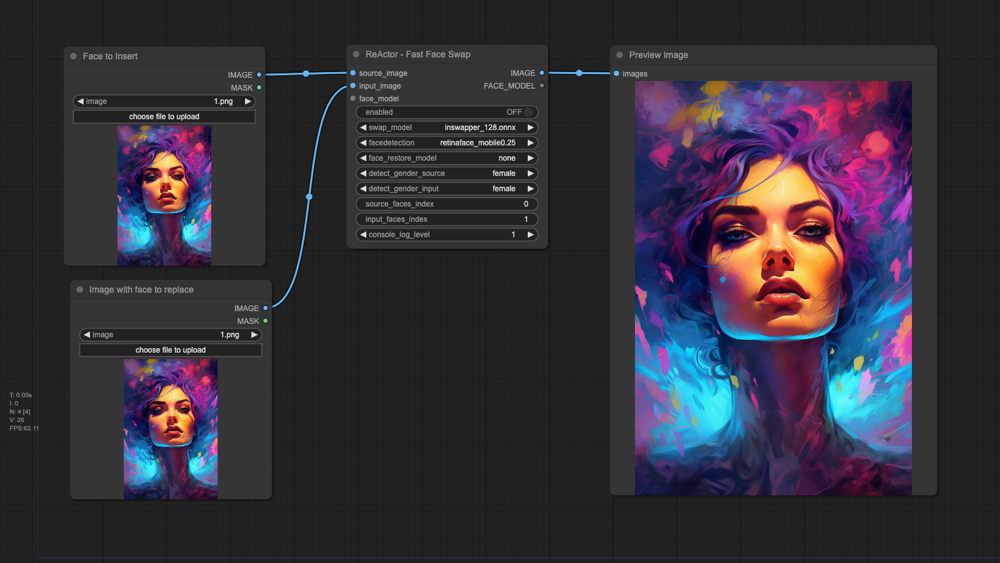
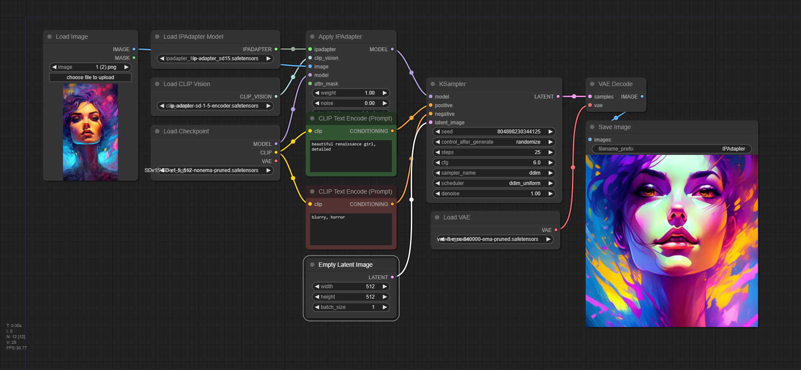

# Comfy UI Workflows 

## Basic SD 1.5

## SDXL 1.0 with Upscale

## Basic Upscale Iterative pipes

## SDXL Turbo

SDXL Turbo Model: https://huggingface.co/stabilityai/sdxl-turbo/tree/main

## SVD Iamge To Video

## ReActor Face Swap

https://github.com/Gourieff/comfyui-reactor-node

https://github.com/mav-rik/facerestore_cf

## IP Adapters

[Nodes github](https://github.com/cubiq/ComfyUI_IPAdapter_plus)

[Tutorial](https://www.youtube.com/watch?v=yrqT5FaBoIU&ab_channel=OlivioSarikas)

## Animated DIFF

https://github.com/Kosinkadink/ComfyUI-AnimateDiff-Evolved
